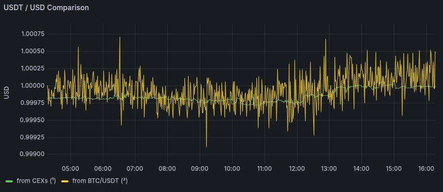

# **Options for the `RIF/USD` price source**

Date: **2026-03-03**


## Options

Currently there are **8** options:

* RIF/USD(B)
* RIF/USD(T)
* RIF/USD(TB)
* RIF/USD(TBMA)
* RIF/USD(TMA)
* RIF/USD(WMTB)
* RIF/USDT(MA)
* RIF/USDT

## Chosen Option

**Selected price source for RIF/USD: `RIF/USD(TMA)`**

### Why `RIF/USD(TMA)` was chosen

We have selected **RIF/USD(TMA)** as the official price source for the `RIF/USD` pair.

**Justification:**

1. **Direct computation through the RIF/USDT pair**  
   `RIF/USD(TMA)` leverages the **RIF/USDT market depth via the DWAP algorithm** (formerly known as “Magic Average”) and then multiplies it by the **USDT/USD price** to obtain the RIF/USD rate. This means the core pricing is derived from the **active RIF/USDT market**, which in practice is the most liquid and widely traded derivative of RIF versus USD-equivalents available.

2. **Orderbook depth-based averaging (DWAP)**  
   The use of the **DWAP algorithm** (analyzed to a 200k depth) reduces the impact of short-term price spikes, outliers, or illiquid trades, producing a **more robust and less noisy price signal** than simple midpoint or last-trade approaches.

3. **Stability and real market reflection**  
   Compared with alternatives that rely on indirect routing via RIF/BTC, BTC/USDT and BTC/USD (such as `RIF/USD(TB)`), `RIF/USD(TMA)` **avoids unnecessary dependencies** on multiple intermediary pairs whose correlated price moves can compound slippage or arbitrage deviations. By **focusing on RIF/USDT and the stable USDT/USD rate**, it reflects directly traded and deeper liquidity conditions.

**In summary:**  
`RIF/USD(TMA)` combines **true market liquidity (via USDT)** with **depth-aware averaging (DWAP)** and the very stable **USDT/USD conversion**, making it the most **robust, reliable, and less noisy computed source** for the `RIF/USD` price among all available options.



(¹) It is the same data for `USDT/USD` weighted median

(²) Respond to the formula `BTC/USD` ÷ `BTC/USDT`


---

## Rationale behind the chosen nomenclature

`RIF/USD(B)`: Because it goes through *RIF/**B**itcoin* and ***B**itcoin/Dollar* to reach the desired pair.

`RIF/USD(T)`: Because it goes through *RIF/**T**ether* and ***T**ether/Dollar* to reach the desired pair.

`RIF/USD(TB)`: Because it goes through *RIF/**T**ether*, ***B**itcoin/Dollar* and *Bitcoin/**T**ether* to get to the desired pair.

`RIF/USD(TBMA)`: Because it goes through *RIF/**T**ether*, ***B**itcoin/Dollar* and *Bitcoin/**T**ether* to get to the desired pair, but using the Use the algorithm [DWAP](fundamentals/dwap.md) formerly known as "**M**agic **A**verage" analyzing the orderbook depth for the `RIF/USDT` pair.

`RIF/USD(TMA)`: Because it goes through *RIF/**T**ether* and ***T**ether/Dollar* to reach the desired pair, but using the algorithm [DWAP](fundamentals/dwap.md) formerly known as "**M**agic **A**verage" algorithm analyzing the orderbook depth for the `RIF/USDT` pair.

`RIF/USD(WMTB)`: Because uses a **W**eighted **M**edian between `RIF/USD(B)` and `RIF/USD(TB)` to reach the desired pair.

`RIF/USDT(MA)`: Because uses the `RIF/USDT` with the algorithm [DWAP](fundamentals/dwap.md) formerly known as "**M**agic **A**verage" algorithm analyzing the orderbook depth.

`RIF/USDT`: Because uses directly the `RIF/USDT` pair.


## Symbols

| Symbol   | Name    | Char   |
|----------|---------|--------|
| BTC      | Bitcoin | ₿      |
| RIF      | RIF     |        |
| USD      | Dollar  | $      |
| USDT     | Tether  | ₮      |


## Coinpairs

| Name          | Coinpair   | Variant   | Method   |
|---------------|------------|-----------|----------|
| BTC/USD       | BTC/USD    |           | Weighted |
| BTC/USDT      | BTC/USDT   |           | Weighted |
| RIF/BTC       | RIF/BTC    |           | Direct   |
| RIF/USD(B)    | RIF/USD    | B         | Computed |
| RIF/USD(T)    | RIF/USD    | T         | Computed |
| RIF/USD(TB)   | RIF/USD    | TB        | Computed |
| RIF/USD(TBMA) | RIF/USD    | TBMA      | Computed |
| RIF/USD(TMA)  | RIF/USD    | TMA       | Computed |
| RIF/USD(WMTB) | RIF/USD    | WMTB      | Computed |
| RIF/USDT      | RIF/USDT   |           | Direct   |
| RIF/USDT(MA)  | RIF/USDT   | MA        | Direct   |
| USDT/USD      | USDT/USD   |           | Weighted |

| Method   | Description                                              |
|----------|----------------------------------------------------------|
| Computed | Compute made with previously obtained coinpairs          |
| Direct   | Direct value from a single source                        |
| Weighted | Weighted median of values obtained from multiple sources |

| Name          | Comment/Description                                                              |
|---------------|----------------------------------------------------------------------------------|
| BTC/USD       |                                                                                  |
| BTC/USDT      |                                                                                  |
| RIF/BTC       |                                                                                  |
| RIF/USD(B)    | Passing through Bitcoin                                                          |
| RIF/USD(T)    | Passing through Tether                                                           |
| RIF/USD(TB)   | Passing through Tether & Bitcoin                                                 |
| RIF/USD(TBMA) | Passing through Tether & Bitcoin, using [DWAP](fundamentals/dwap.md), 200k depth |
| RIF/USD(TMA)  | Passing through Tether, using [DWAP](fundamentals/dwap.md), 200k depth           |
| RIF/USD(WMTB) | Passing through Tether & Bitcoin using weighted median                           |
| RIF/USDT      |                                                                                  |
| RIF/USDT(MA)  | Using [DWAP](fundamentals/dwap.md), 200k depth                                   |
| USDT/USD      |                                                                                  |


## Formulas used in the computed coinpairs

```
RIF/USD(B)     =  rif_btc × btc_usd
RIF/USD(T)     =  rif_usdt × usdt_usd
RIF/USD(TB)    =  rif_usdt × btc_usd / btc_usdt
RIF/USD(TBMA)  =  rif_usdt_ma × btc_usd / btc_usdt
RIF/USD(TMA)   =  rif_usdt_ma × usdt_usd
RIF/USD(WMTB)  =  Weighted(
                    (rif_usdt × btc_usd / btc_usdt) at 75%,
                    (rif_btc × btc_usd) at 25%
                  )
```


## Weights used for each obtained coinpairs from multiple sources

If a price source is not available, this source is discarded
and the rest of the sources are used but with their weights recalculated
proportionally.
For example, you have 3 sources with 3 weights A:0.2, B:0.5, C:0.3
and if for some reason B would not be available, A:0.4, C:0.6 would
be used.

The weights used are fixed values.
These weightings are related to the historical volume handled by each
price source.
Every established period of time we review the historical volume of the
sources and if necessary we apply the changes to the parameterization.


### For coinpair BTC/USD (from Bitcoin to Dollar)

| Source   |   Weight | URI                                                  |
|----------|----------|------------------------------------------------------|
| Coinbase |     0.25 | https://api.coinbase.com/v2/prices/spot?currency=USD |
| Bitstamp |     0.22 | https://www.bitstamp.net/api/v2/ticker/btcusd/       |
| Bitfinex |     0.18 | https://api-pub.bitfinex.com/v2/ticker/tBTCUSD       |
| Kraken   |     0.18 | https://api.kraken.com/0/public/Ticker?pair=XXBTZUSD |
| Gemini   |     0.17 | https://api.gemini.com/v1/pubticker/BTCUSD           |


### For coinpair RIF/BTC (from RIF to Bitcoin)

Only Binance (URI: https://api.binance.com/api/v3/ticker/24hr?symbol=RIFBTC)


### For coinpair RIF/USDT (from RIF to Tether)

Only Binance (URI: https://api.binance.com/api/v3/ticker/24hr?symbol=RIFUSDT)


### For coinpair RIF/USDT(MA) (from RIF to Tether)

Only Binance (URI: https://api.binance.com/api/v3/depth?symbol=RIFUSDT)


### For coinpair BTC/USDT (from Bitcoin to Tether)

| Source   |   Weight | URI                                                                   |
|----------|----------|-----------------------------------------------------------------------|
| Binance  |     0.65 | https://api.binance.com/api/v3/ticker/bookTicker?symbol=BTCUSDT       |
| OKX      |     0.15 | https://www.okx.com/api/v5/market/ticker?instId=BTC-USDT              |
| Bybit    |     0.10 | https://api.bybit.com/v5/market/tickers?category=spot&symbol=BTCUSDT  |
| Huobi    |     0.05 | https://api.huobi.pro/market/detail/merged?symbol=btcusdt             |
| KuCoin   |     0.05 | https://api.kucoin.com/api/v1/market/orderbook/level1?symbol=BTC-USDT |


### For coinpair USDT/USD (from Tether to Dollar)

| Source   |   Weight | URI                                                        |
|----------|----------|------------------------------------------------------------|
| Bitstamp |     0.15 | https://www.bitstamp.net/api/v2/ticker/usdtusd/            |
| Coinbase |     0.35 | https://api.exchange.coinbase.com/products/USDT-USD/ticker |
| Gemini   |     0.15 | https://api.gemini.com/v1/pubticker/usdtusd                |
| Kraken   |     0.35 | https://api.kraken.com/0/public/Ticker?pair=USDTUSD        |

## The `moc_prices_source_check` tool

There is a tool that comes with the [`moc_prices_source` package](https://github.com/money-on-chain/moc_prices_source) that allows us to run a simulation that queries and calculates all the coinpairs.
This tool is called `moc_prices_source_check` and here you can see an example of its use.

### Example

```shell
user@workstation:~$ moc_prices_source_check --help
Usage: moc_prices_source_check [OPTIONS] [COINPAIRS_FILTER]

  Description:
      CLI-type tool that shows the data obtained by
      the `moc_price_source` library.   
      Useful for troubleshooting.

  COINPAIRS_FILTER:
      Is a display pairs filter that accepts wildcards.
      Example: "btc*"
      Default value: "*" (all available pairs)

Options:
  -v, --verbose                   Verbose mode.
  --version                       Show version and exit.
  -j, --json                      Show data in JSON format and exit.
  -w, --weighing                  Show the default weighing and exit.
  -c, --computed                  Show the computed pairs formula and exit.
  -e, --show-envs                 Show used ENV variables used and exit.
  -s, --summary                   Show the summary and exit.
  -m, --markdown                  Set markdown for the summary format.
  -n, --not-ignore-zero-weighing  Not ignore sources with zero weighing.
  -h, --help                      Show this message and exit.

user@workstation:~$ moc_prices_source_check "RIF/USD*"

Coinpair    V.    Short description     Exchnage    Response        Weight    %  Time
----------  ----  --------------------  ----------  ------------  --------  ---  ------
BTC/USD           Bitcoin to Dollar     Bitfinex    $  68.69800K      0.18   18  149ms
BTC/USD           Bitcoin to Dollar     Bitstamp    $  68.65900K      0.22   22  843ms
BTC/USD           Bitcoin to Dollar     Coinbase    $  68.69866K      0.25   25  1.01s
BTC/USD           Bitcoin to Dollar     Gemini      $  68.66351K      0.17   17  989ms
BTC/USD           Bitcoin to Dollar     Kraken      $  68.67200K      0.18   18  456ms
BTC/USDT          Bitcoin to Tether     Binance     ₮  68.66262K      0.65   65  466ms
BTC/USDT          Bitcoin to Tether     Bybit       ₮  68.65815K      0.1    10  501ms
BTC/USDT          Bitcoin to Tether     Huobi       ₮  68.65703K      0.05    5  650ms
BTC/USDT          Bitcoin to Tether     KuCoin      ₮  68.65075K      0.05    5  703ms
BTC/USDT          Bitcoin to Tether     OKX         ₮  68.64725K      0.15   15  729ms
RIF/BTC           RIF to Bitcoin        Binance     ₿ 380.00000p      1     100  464ms
RIF/USDT    MA    RIF to Tether         Binance     ₮  31.23364m      1     100  448ms
RIF/USDT    MA2   RIF to Tether         Binance     ₮  31.22908m      1     100  440ms
RIF/USDT    MA3   RIF to Tether         Binance     ₮  31.22179m      1     100  453ms
RIF/USDT    mp1%  To move the price 1%  Binance     ₮  73.22692K      1     100  337ms
RIF/USDT          RIF to Tether         Binance     ₮  31.20000m      1     100  439ms
USDT/USD          Tether to Dollar      Bitstamp    $   1.00004       0.15   15  343ms
USDT/USD          Tether to Dollar      Coinbase    $   1.00004       0.35   35  491ms
USDT/USD          Tether to Dollar      Gemini      $ 999.95500m      0.15   15  904ms
USDT/USD          Tether to Dollar      Kraken      $ 999.97500m      0.35   35  452ms

    Coinpair                Value   Sources count    Ok   Time
--  --------------  -------------  ---------------  ----  ------
⇓   BTC/USD         68,672.000000      5 of 5        ✓    1.01s
⇓   BTC/USDT        68,662.625000      5 of 5        ✓    729ms
↓   RIF/BTC          3.800 × 10⁻⁷      1 of 1        ✓    464ms
ƒ   RIF/USD              0.026095        N/A         ✓    <10ms
ƒ   RIF/USD(B)           0.026095        N/A         ✓    <10ms
ƒ   RIF/USD(T)           0.031199        N/A         ✓    <10ms
ƒ   RIF/USD(TB)          0.031204        N/A         ✓    <10ms
ƒ   RIF/USD(TBMA)        0.031238        N/A         ✓    <10ms
ƒ   RIF/USD(TBMA2)       0.031233        N/A         ✓    <10ms
ƒ   RIF/USD(TBMA3)       0.031226        N/A         ✓    <10ms
ƒ   RIF/USD(TMA)         0.031233        N/A         ✓    <10ms
ƒ   RIF/USD(TMA2)        0.031228        N/A         ✓    <10ms
ƒ   RIF/USD(TMA3)        0.031221        N/A         ✓    <10ms
ƒ   RIF/USD(WMTB)        0.029927        N/A         ✓    <10ms
↓   RIF/USDT             0.031200      1 of 1        ✓    439ms
↓   RIF/USDT(MA)         0.031234      1 of 1        ✓    448ms
↓   RIF/USDT(MA2)        0.031229      1 of 1        ✓    440ms
↓   RIF/USDT(MA3)        0.031222      1 of 1        ✓    453ms
↓   RIF/USDT(mp1%)  73,226.915700      1 of 1        ✓    337ms
⇓   USDT/USD             0.999969      4 of 4        ✓    904ms

Response time 1.05s

user@workstation:~$
```

